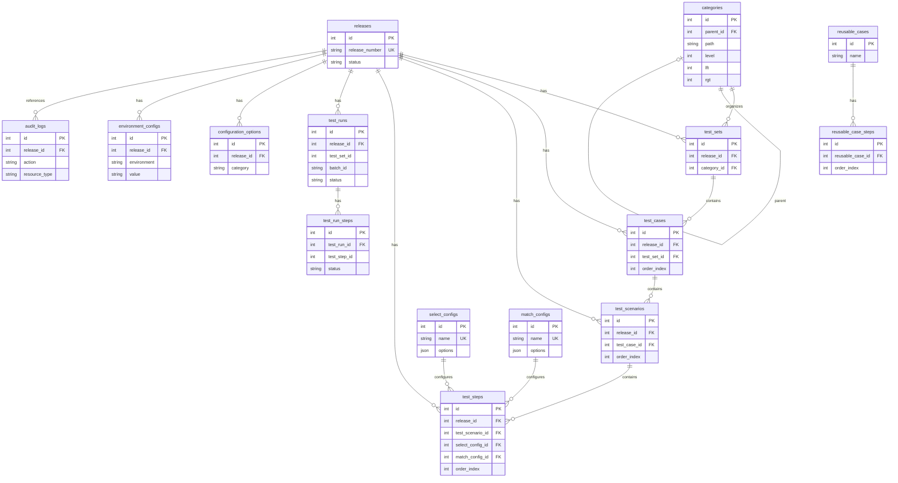

# Development & Architecture Guide

Technical documentation for developers working on the UAT Data-Driven Testing CMS.

---

## Table of Contents

1. [Database Schema](#database-schema)
2. [Release Management](#release-management)
3. [Test Set Creation](#test-set-creation)
4. [Test Case Creation](#test-case-creation)
5. [Scenario Management](#scenario-management)
6. [Step Management](#step-management)
7. [Reusable Cases](#reusable-cases)
8. [Test Execution](#test-execution)
9. [Report Generation](#report-generation)
10. [Key Implementation Patterns](#key-implementation-patterns)

---

## Database Schema

The application uses a unified SQLite database via `@libsql/client`. All release-specific data includes a `release_id` foreign key for multi-tenancy.

### Entity Relationship Diagram



### Cascade Behaviors

| Parent Table     | Child Table                                                                                                            | On Delete |
| ---------------- | ---------------------------------------------------------------------------------------------------------------------- | --------- |
| `releases`       | `test_sets`, `test_cases`, `test_scenarios`, `test_steps`, `test_runs`, `configuration_options`, `environment_configs` | CASCADE   |
| `test_runs`      | `test_run_steps`                                                                                                       | CASCADE   |
| `reusable_cases` | `reusable_case_steps`                                                                                                  | CASCADE   |
| `categories`     | `categories` (parent_id)                                                                                               | SET NULL  |
| `categories`     | `test_sets` (category_id)                                                                                              | SET NULL  |

### Key Indexes

```sql
-- Performance-critical indexes
CREATE INDEX idx_test_sets_release ON test_sets(release_id);
CREATE INDEX idx_test_sets_category ON test_sets(category_id);
CREATE INDEX idx_test_cases_order ON test_cases(test_set_id, order_index);
CREATE INDEX idx_test_scenarios_order ON test_scenarios(test_case_id, order_index);
CREATE INDEX idx_test_steps_order ON test_steps(test_scenario_id, order_index);
CREATE INDEX idx_test_runs_batch ON test_runs(batch_id);
CREATE INDEX idx_audit_logs_timestamp ON audit_logs(timestamp DESC);
```

---

## Release Management

### Creating a New Release

**Endpoint:** `POST /api/releases`

```typescript
interface CreateReleaseRequest {
  release_number: string; // Must be unique
  description?: string;
  notes?: string;
}
```

**Process Flow:**

```
1. Validate release_number uniqueness
2. INSERT into releases (status = 'open')
3. Find previous release: SELECT * FROM releases ORDER BY created_at DESC LIMIT 1
4. If previous release exists:
   └─ copyReleaseData(sourceReleaseId, newReleaseId)
5. If no previous release:
   └─ seedDefaultConfig(newReleaseId)
6. Audit log: CREATE release
7. Return new release
```

### Release Data Copy Process

When creating a new release, all test data from the most recent release is copied:

```typescript
async function copyReleaseData(sourceId: number, targetId: number): Promise<void> {
  // Build ID mappings for foreign key updates
  const testSetMapping = new Map<number, number>();
  const testCaseMapping = new Map<number, number>();
  const scenarioMapping = new Map<number, number>();

  // 1. Copy test_sets (preserves category_id)
  for (const set of sourceTestSets) {
    const newId = INSERT test_sets(..., release_id = targetId);
    testSetMapping.set(set.id, newId);
  }

  // 2. Copy test_cases (uses testSetMapping)
  for (const tc of sourceTestCases) {
    const newTestSetId = testSetMapping.get(tc.test_set_id);
    const newId = INSERT test_cases(..., release_id = targetId, test_set_id = newTestSetId);
    testCaseMapping.set(tc.id, newId);
  }

  // 3. Copy test_scenarios (uses testCaseMapping)
  for (const scenario of sourceScenarios) {
    const newTestCaseId = testCaseMapping.get(scenario.test_case_id);
    const newId = INSERT test_scenarios(..., release_id = targetId, test_case_id = newTestCaseId);
    scenarioMapping.set(scenario.id, newId);
  }

  // 4. Copy test_steps (uses scenarioMapping)
  for (const step of sourceSteps) {
    const newScenarioId = scenarioMapping.get(step.test_scenario_id);
    INSERT test_steps(..., release_id = targetId, test_scenario_id = newScenarioId);
  }

  // 5. Copy configuration_options
  INSERT configuration_options(..., release_id = targetId) FROM source;
}
```

### Default Configuration Seeding

If no previous release exists, default configurations are created:

```typescript
const DEFAULT_TYPES = [
  'button-click',
  'field-input',
  'dropdown-select',
  'checkbox-toggle',
  'radio-select',
  'link-click',
  'navigation',
  'assertion',
  'wait',
  'hover',
  'scroll',
  'file-upload',
  'date-picker',
  'modal-interaction',
  'table-interaction',
  'custom',
];

const DEFAULT_ACTIONS = [
  'Click',
  'Text Match',
  'Visible',
  'Enabled',
  'Checked',
  'Selected Value',
  'Attribute Value',
  'CSS Value',
];
```

### Release Status Lifecycle

```
draft ──► open ──► closed ──► archived
  ▲         │         │
  └─────────┴─────────┘
       (reopen)
```

**Endpoints:**

- `PUT /api/releases/:id/draft` - Move to draft
- `PUT /api/releases/:id/close` - Close release
- `PUT /api/releases/:id/reopen` - Reopen closed release
- `PUT /api/releases/:id/archive` - Archive release

---

## Test Set Creation

**Endpoint:** `POST /api/test-sets/:releaseId`

```typescript
interface CreateTestSetRequest {
  name: string;
  description?: string;
  category_id?: number | null;
}
```

**Process:**

```sql
INSERT INTO test_sets (release_id, name, description, category_id, created_at, created_by)
VALUES (?, ?, ?, ?, datetime('now'), ?);
```

**Response includes displayPath** built from category hierarchy:

```typescript
// If category_id = 5 with path "1/3/5"
// Resolves to: "Root Category / Parent / Current Category"
function buildDisplayPath(categoryId: number): string {
  const pathIds = category.path.split('/');
  const names = SELECT name FROM categories WHERE id IN (pathIds);
  return names.join(' / ');
}
```

### Listing Test Sets with Aggregates

```sql
SELECT
  ts.*,
  COUNT(DISTINCT tc.id) as case_count,
  COUNT(DISTINCT tsc.id) as scenario_count
FROM test_sets ts
LEFT JOIN test_cases tc ON tc.test_set_id = ts.id
LEFT JOIN test_scenarios tsc ON tsc.test_case_id = tc.id
WHERE ts.release_id = ?
GROUP BY ts.id;
```

---

## Test Case Creation

**Endpoint:** `POST /api/test-cases/:releaseId`

```typescript
interface CreateTestCaseRequest {
  testSetId: number;
  name: string;
  description?: string;
  order_index?: number;
}
```

**Critical Behavior:** A default scenario is automatically created with each test case.

```typescript
// Transaction wrapper
await db.execute('BEGIN');

try {
  // 1. Create test case
  const caseResult = await db.execute(
    `INSERT INTO test_cases (release_id, test_set_id, name, description, order_index, created_at)
     VALUES (?, ?, ?, ?, ?, datetime('now'))`,
    [releaseId, testSetId, name, description, orderIndex]
  );
  const testCaseId = caseResult.lastInsertRowid;

  // 2. Create default scenario
  await db.execute(
    `INSERT INTO test_scenarios (release_id, test_case_id, name, order_index, created_at)
     VALUES (?, ?, 'Default Scenario', 0, datetime('now'))`,
    [releaseId, testCaseId]
  );

  await db.execute('COMMIT');
} catch (error) {
  await db.execute('ROLLBACK');
  throw error;
}
```

### Reordering Test Cases

**Endpoint:** `PUT /api/test-cases/:releaseId/reorder`

```typescript
interface ReorderRequest {
  testSetId: number;
  caseIds: number[]; // Array in desired order
}

// Updates order_index based on array position
for (let i = 0; i < caseIds.length; i++) {
  await db.execute('UPDATE test_cases SET order_index = ? WHERE id = ? AND release_id = ?', [
    i,
    caseIds[i],
    releaseId,
  ]);
}
```

---

## Scenario Management

### Creating Scenarios

**Endpoint:** `POST /api/test-cases/scenarios/:releaseId`

```typescript
interface CreateScenarioRequest {
  testCaseId: number;
  name: string;
  description?: string;
}
```

### Fetching All Scenarios for a Test Set

**Endpoint:** `GET /api/test-cases/all-scenarios/:releaseId?testSetId=X`

Returns scenarios across all test cases in a set, used for the scenario sidebar:

```sql
SELECT ts.*, tc.name as case_name
FROM test_scenarios ts
JOIN test_cases tc ON tc.id = ts.test_case_id
WHERE tc.test_set_id = ? AND ts.release_id = ?
ORDER BY tc.order_index, ts.order_index;
```

### Deleting a Scenario

Cascades to delete all child steps:

```typescript
await db.execute('BEGIN');

// 1. Delete all steps in the scenario
await db.execute('DELETE FROM test_steps WHERE test_scenario_id = ? AND release_id = ?', [
  scenarioId,
  releaseId,
]);

// 2. Delete the scenario
await db.execute('DELETE FROM test_scenarios WHERE id = ? AND release_id = ?', [
  scenarioId,
  releaseId,
]);

await db.execute('COMMIT');
```

---

## Step Management

### Step Data Structure

```typescript
interface TestStep {
  id: number;
  release_id: number;
  test_scenario_id: number;
  order_index: number;
  step_definition: string; // Human-readable step description
  type: string; // e.g., 'field-input', 'button-click'
  element_id: string; // CSS selector or data-testid
  action: string; // e.g., 'Click', 'Text Match'
  action_result: string; // Expected value or action input
  select_config_id?: number; // FK to select_configs
  match_config_id?: number; // FK to match_configs
  required: boolean;
  expected_results: string;
}
```

### Updating a Step

**Endpoint:** `PATCH /api/test-steps/:releaseId/:id`

Supports partial updates with audit trail:

```typescript
// Capture old values for audit
const oldStep = await db.execute('SELECT * FROM test_steps WHERE id = ?', [id]);

// Build dynamic update query
const updates: string[] = [];
const values: any[] = [];

if (body.step_definition !== undefined) {
  updates.push('step_definition = ?');
  values.push(body.step_definition);
}
// ... repeat for other fields

await db.execute(
  `UPDATE test_steps SET ${updates.join(', ')}, updated_at = datetime('now')
   WHERE id = ? AND release_id = ?`,
  [...values, id, releaseId]
);

// Audit log with old/new values
auditLogger.log({
  action: 'UPDATE',
  resourceType: 'test_step',
  oldValue: oldStep,
  newValue: updatedStep,
});
```

### Bulk Step Sync (Critical for UI)

**Endpoint:** `POST /api/test-steps/:releaseId/sync`

Used by the drag-and-drop editor for atomic reordering and bulk updates:

```typescript
interface SyncRequest {
  scenarioId: number;
  steps: StepData[];  // Array in desired order
}

await db.execute('BEGIN');

// 1. Delete ALL existing steps for scenario
await db.execute(
  'DELETE FROM test_steps WHERE test_scenario_id = ? AND release_id = ?',
  [scenarioId, releaseId]
);

// 2. Insert all steps with new order_index
for (let i = 0; i < steps.length; i++) {
  await db.execute(
    `INSERT INTO test_steps (
      release_id, test_scenario_id, order_index, step_definition,
      type, element_id, action, action_result, select_config_id,
      match_config_id, required, expected_results, created_at
    ) VALUES (?, ?, ?, ?, ?, ?, ?, ?, ?, ?, ?, ?, datetime('now'))`,
    [releaseId, scenarioId, i, step.step_definition, ...]
  );
}

await db.execute('COMMIT');
```

### Step Deletion with Reordering

```typescript
await db.execute('BEGIN');

// 1. Get step's order_index and scenario_id
const step = SELECT order_index, test_scenario_id FROM test_steps WHERE id = ?;

// 2. Delete the step
await db.execute('DELETE FROM test_steps WHERE id = ?', [stepId]);

// 3. Reorder remaining steps (close the gap)
await db.execute(
  `UPDATE test_steps
   SET order_index = order_index - 1
   WHERE test_scenario_id = ? AND order_index > ?`,
  [step.test_scenario_id, step.order_index]
);

await db.execute('COMMIT');
```

---

## Reusable Cases

Reusable cases are global templates (not release-scoped) that can be copied into any release.

### Creating a Reusable Case

**Endpoint:** `POST /api/reusable-cases`

```typescript
interface CreateReusableCaseRequest {
  name: string;
  description?: string;
  steps?: ReusableCaseStepInput[]; // Optional initial steps
}
```

### Copying a Reusable Case to a Test Set

**Endpoint:** `POST /api/reusable-cases/:id/copy-to`

```typescript
interface CopyToRequest {
  releaseId: number;
  testSetId: number;
}

// Process:
async function copyReusableCaseToTestSet(
  reusableCaseId: number,
  releaseId: number,
  testSetId: number
): Promise<{ caseId: number; scenarioId: number; stepsCopied: number }> {

  // 1. Get reusable case and steps
  const reusableCase = SELECT * FROM reusable_cases WHERE id = ?;
  const steps = SELECT * FROM reusable_case_steps WHERE reusable_case_id = ? ORDER BY order_index;

  // 2. Find max order_index in test set
  const maxOrder = SELECT MAX(order_index) FROM test_cases WHERE test_set_id = ?;

  // 3. Create test case
  const caseResult = INSERT INTO test_cases (
    release_id, test_set_id, name, description, order_index
  ) VALUES (?, ?, reusableCase.name, reusableCase.description, maxOrder + 1);

  // 4. Create default scenario
  const scenarioResult = INSERT INTO test_scenarios (
    release_id, test_case_id, name, order_index
  ) VALUES (?, caseResult.id, 'Default Scenario', 0);

  // 5. Copy all steps to new scenario
  for (const step of steps) {
    INSERT INTO test_steps (
      release_id, test_scenario_id, order_index, step_definition,
      type, element_id, action, action_result, select_config_id,
      match_config_id, required, expected_results
    ) VALUES (
      releaseId, scenarioResult.id, step.order_index, step.step_definition,
      step.type, step.element_id, step.action, step.action_result,
      step.select_config_id, step.match_config_id, step.required,
      step.expected_results
    );
  }

  return {
    caseId: caseResult.id,
    scenarioId: scenarioResult.id,
    stepsCopied: steps.length
  };
}
```

### Creating a Reusable Case from Existing Test Case

**Endpoint:** `POST /api/reusable-cases/from-case`

```typescript
interface CreateFromCaseRequest {
  releaseId: number;
  caseId: number;
  name?: string;        // Override name
  description?: string;
}

// Process:
// 1. Fetch test case
const testCase = SELECT * FROM test_cases WHERE id = ? AND release_id = ?;

// 2. Fetch ALL scenarios for this case
const scenarios = SELECT * FROM test_scenarios WHERE test_case_id = ? ORDER BY order_index;

// 3. Fetch ALL steps from ALL scenarios
const allSteps = [];
for (const scenario of scenarios) {
  const steps = SELECT * FROM test_steps WHERE test_scenario_id = ? ORDER BY order_index;
  allSteps.push(...steps);
}

// 4. Create reusable case
const reusableCase = INSERT INTO reusable_cases (name, description);

// 5. Copy all steps (flattened from all scenarios)
for (let i = 0; i < allSteps.length; i++) {
  INSERT INTO reusable_case_steps (
    reusable_case_id, order_index, ...stepFields
  ) VALUES (reusableCase.id, i, ...);
}
```

---

## Test Execution

### Architecture Overview

```
┌─────────────────────────────────────────────────────────────────────┐
│                         Frontend (React)                            │
├─────────────────────────────────────────────────────────────────────┤
│  TestRunModal          │  Run7PSModal           │  BatchReportModal │
│  - Single execution    │  - Parallel execution  │  - Results view   │
│  - Env selection       │  - Progress tracking   │  - PDF download   │
└────────────┬───────────┴────────────┬───────────┴────────────┬──────┘
             │                        │                        │
             ▼                        ▼                        ▼
┌─────────────────────────────────────────────────────────────────────┐
│                       Express API Server                            │
├─────────────────────────────────────────────────────────────────────┤
│  POST /test-runs/execute/:testSetId   POST /test-runs/execute-all   │
│  GET /test-runs/:id/status            GET /test-runs/batch/:id/...  │
└────────────┬───────────────────────────────────┬────────────────────┘
             │                                   │
             ▼                                   ▼
┌─────────────────────────┐     ┌────────────────────────────────────┐
│  testExecutionQueue.ts  │     │  parallelTestExecution.ts          │
│  - Sequential FIFO      │     │  - Max 7 concurrent                │
│  - Single process       │     │  - Batch ID tracking               │
└────────────┬────────────┘     └────────────────┬───────────────────┘
             │                                   │
             └───────────────┬───────────────────┘
                             ▼
┌─────────────────────────────────────────────────────────────────────┐
│                    Child Process (per test set)                     │
├─────────────────────────────────────────────────────────────────────┤
│  npx tsx tests/runner.ts                                            │
│                                                                     │
│  Environment Variables:                                             │
│  - TEST_RUN_ID, TEST_SET_ID, RELEASE_ID                             │
│  - TEST_BASE_URL (resolved from environment_configs)                │
│  - IS_BATCH_RUN (true for 7PS)                                      │
│  - PLAYWRIGHT_WORKERS=1                                             │
└────────────┬────────────────────────────────────────────────────────┘
             │
             ▼
┌─────────────────────────────────────────────────────────────────────┐
│                      Playwright Browser                             │
│  - Executes test steps via actionHandlers.ts                        │
│  - Screenshots on failure                                           │
│  - Video recording                                                  │
└─────────────────────────────────────────────────────────────────────┘
```

### Single Test Set Execution

**Endpoint:** `POST /api/test-runs/execute/:testSetId`

```typescript
interface ExecuteRequest {
  releaseId: number;
  environment: string; // e.g., 'qa', 'dev', 'prod'
}
```

**Process:**

```typescript
// 1. Resolve environment URL
const envConfig = await db.execute(
  `SELECT value FROM environment_configs
   WHERE (release_id = ? OR release_id IS NULL)
   AND environment = ?
   ORDER BY release_id DESC NULLS LAST
   LIMIT 1`,
  [releaseId, environment]
);
const baseUrl = envConfig.rows[0].value;

// 2. Create test_run record
const testRun = await db.execute(
  `INSERT INTO test_runs (
    release_id, test_set_id, test_set_name, status, environment,
    base_url, executed_by, executed_at
  ) VALUES (?, ?, ?, 'running', ?, ?, ?, datetime('now'))`,
  [releaseId, testSetId, testSetName, environment, baseUrl, user.eid]
);

// 3. Enqueue for execution
testExecutionQueue.enqueue({
  testRunId: testRun.lastInsertRowid,
  testSetId,
  releaseId,
  baseUrl,
});

return { testRunId: testRun.lastInsertRowid };
```

### Queue Processing (testExecutionQueue.ts)

```typescript
class TestExecutionQueue {
  private queue: QueueItem[] = [];
  private currentExecution: CurrentExecution | null = null;

  enqueue(item: QueueItem): void {
    this.queue.push({ ...item, addedAt: new Date() });
    if (!this.currentExecution) {
      this.processNext();
    }
  }

  private async processNext(): Promise<void> {
    const item = this.queue.shift();
    if (!item) return;

    this.currentExecution = { ...item, startedAt: new Date() };

    // Spawn Playwright runner
    const child = spawn('npx', ['tsx', 'tests/runner.ts'], {
      cwd: projectRoot,
      env: {
        ...process.env,
        TEST_RUN_ID: String(item.testRunId),
        TEST_SET_ID: String(item.testSetId),
        RELEASE_ID: String(item.releaseId),
        TEST_BASE_URL: item.baseUrl,
        API_BASE_URL: `http://localhost:${process.env.PORT || 3000}`,
      },
      stdio: ['pipe', 'pipe', 'pipe'],
    });

    // Stream progress events
    child.stdout.on('data', (data) => {
      const lines = data.toString().split('\n');
      for (const line of lines) {
        if (line.startsWith('PROGRESS:')) {
          const progress = JSON.parse(line.slice(9));
          this.emit('progress', { testRunId: item.testRunId, ...progress });
        }
      }
    });

    // Collect result on exit
    child.on('close', async (code) => {
      const result = this.parseResult(stdoutBuffer);
      await this.saveResults(item.testRunId, result);
      this.currentExecution = null;
      setTimeout(() => this.processNext(), 100);
    });
  }
}
```

### 7PS Parallel Execution

**Endpoint:** `POST /api/test-runs/execute-all`

```typescript
interface ExecuteAllRequest {
  releaseId: number;
  environment: string;
}
```

**Process:**

```typescript
// 1. Generate batch ID
const batchId = `batch-${Date.now()}-${randomString(6)}`;

// 2. Fetch all test sets
const testSets = await db.execute(
  'SELECT id, name FROM test_sets WHERE release_id = ? ORDER BY name',
  [releaseId]
);

// 3. Create test_run for each set
const testRunIds: number[] = [];
for (const set of testSets.rows) {
  const result = await db.execute(
    `INSERT INTO test_runs (
      release_id, test_set_id, test_set_name, batch_id, status,
      environment, base_url, executed_by, executed_at
    ) VALUES (?, ?, ?, ?, 'pending', ?, ?, ?, datetime('now'))`,
    [releaseId, set.id, set.name, batchId, environment, baseUrl, user.eid]
  );
  testRunIds.push(result.lastInsertRowid);
}

// 4. Start parallel execution
parallelTestExecution.startBatch(items);

return { batchId, testRunIds, totalSets: testSets.rows.length };
```

### Parallel Execution Manager (parallelTestExecution.ts)

```typescript
const MAX_CONCURRENT = 7;

class ParallelTestExecution {
  private batches = new Map<string, BatchState>();

  async startBatch(items: BatchItem[]): Promise<void> {
    const batchId = items[0].batchId;
    const state: BatchState = {
      totalSets: items.length,
      completedSets: 0,
      passedSets: 0,
      failedSets: 0,
      queue: [...items],
      running: new Set(),
      results: [],
    };
    this.batches.set(batchId, state);

    // Start up to MAX_CONCURRENT executions
    for (let i = 0; i < Math.min(MAX_CONCURRENT, items.length); i++) {
      this.executeNext(batchId);
    }
  }

  private async executeNext(batchId: string): Promise<void> {
    const state = this.batches.get(batchId);
    const item = state.queue.shift();
    if (!item) return;

    state.running.add(item.testRunId);

    const child = spawn('npx', ['tsx', 'tests/runner.ts'], {
      env: {
        ...process.env,
        TEST_RUN_ID: String(item.testRunId),
        IS_BATCH_RUN: 'true',
        PLAYWRIGHT_WORKERS: '1',
      },
    });

    child.on('close', async () => {
      state.running.delete(item.testRunId);
      state.completedSets++;

      // Update pass/fail counts
      if (result.status === 'passed') state.passedSets++;
      else state.failedSets++;

      // Start next if queue has items
      if (state.queue.length > 0) {
        this.executeNext(batchId);
      }

      // Check if batch complete
      if (state.completedSets === state.totalSets) {
        await this.finalizeBatch(batchId);
      }
    });
  }

  private async finalizeBatch(batchId: string): Promise<void> {
    // Wait for filesystem sync
    await new Promise((resolve) => setTimeout(resolve, 2000));

    // Merge individual Cucumber reports
    await mergeBatchCucumberReports(testRunIds);
  }
}
```

### Playwright Runner (tests/runner.ts)

```typescript
// Environment variables
const testRunId = process.env.TEST_RUN_ID;
const testSetId = process.env.TEST_SET_ID;
const releaseId = process.env.RELEASE_ID;
const baseUrl = process.env.TEST_BASE_URL;
const isBatchRun = process.env.IS_BATCH_RUN === 'true';

async function runTests(): Promise<void> {
  // 1. Fetch test data from API
  const testData = await fetch(
    `${apiBaseUrl}/api/test-generation/${testSetId}?releaseId=${releaseId}`
  ).then((r) => r.json());

  // 2. Launch browser
  const browser = await chromium.launch();
  const context = await browser.newContext({
    recordVideo: { dir: `tests/reports/results/run-${testRunId}` },
  });
  const page = await context.newPage();

  // 3. Execute each scenario
  for (const testCase of testData.testCases) {
    for (const scenario of testCase.scenarios) {
      // Output progress
      console.log(
        `PROGRESS:${JSON.stringify({
          currentScenario: scenarioIndex,
          totalScenarios: totalScenarios,
          scenarioName: scenario.name,
          caseName: testCase.name,
        })}`
      );

      for (const step of scenario.steps) {
        const result = await executeStep(page, step);
        stepResults.push(result);
      }
    }
  }

  // 4. Output result
  console.log(
    `RESULT:${JSON.stringify({
      testRunId,
      status: allPassed ? 'passed' : 'failed',
      durationMs: Date.now() - startTime,
      steps: stepResults,
      videoPath: `tests/reports/results/run-${testRunId}/video.webm`,
    })}`
  );

  // 5. Save Cucumber report (for batch runs)
  if (isBatchRun) {
    await fs.writeFile(`report/result-${testRunId}.json`, JSON.stringify(cucumberReport));
  }
}
```

### Action Handlers (tests/fixtures/actionHandlers.ts)

```typescript
async function executeStep(page: Page, step: TestStep): Promise<StepResult> {
  const locator = resolveLocator(page, step.element_id);

  switch (step.action.toLowerCase()) {
    case 'click':
      await locator.click();
      break;

    case 'fill':
    case 'type':
      await locator.fill(step.action_result);
      break;

    case 'select':
      await locator.selectOption(step.action_result);
      break;

    case 'text match':
    case 'assert text':
      await expect(locator).toHaveText(step.expected_results);
      break;

    case 'visible':
      await expect(locator).toBeVisible();
      break;

    case 'navigate':
      await page.goto(step.action_result);
      break;

    case 'wait':
      await locator.waitFor({ state: 'visible' });
      break;

    // ... more actions
  }
}

function resolveLocator(page: Page, elementId: string): Locator {
  if (elementId.startsWith('getByTestId:')) {
    return page.getByTestId(elementId.slice(12));
  }
  if (elementId.startsWith('data-testid=')) {
    return page.locator(`[data-testid="${elementId.slice(12)}"]`);
  }
  return page.locator(elementId); // CSS selector
}
```

---

## Report Generation

### PDF Reports

**Endpoint:** `POST /api/test-runs/:id/pdf` (generate) or `GET /api/test-runs/:id/pdf` (download)

**Process (pdfGenerator.ts):**

```typescript
async function generatePdfReport(testRunId: number): Promise<string> {
  // 1. Fetch test run data
  const testRun = SELECT * FROM test_runs WHERE id = ?;
  const steps = SELECT * FROM test_run_steps WHERE test_run_id = ? ORDER BY executed_at;

  // 2. Group steps by case → scenario
  const grouped = groupStepsByCaseAndScenario(steps);

  // 3. Generate HTML
  const html = `
    <!DOCTYPE html>
    <html>
    <head>
      <style>
        /* Print-optimized CSS */
        body { font-family: Arial, sans-serif; }
        .status-passed { color: #22c55e; }
        .status-failed { color: #ef4444; }
        .step-row { border-bottom: 1px solid #e5e7eb; padding: 8px 0; }
        .error-message { background: #fef2f2; padding: 8px; margin-top: 4px; }
      </style>
    </head>
    <body>
      <h1>Test Run Report</h1>
      <div class="metadata">
        <p>Release: ${testRun.release_number}</p>
        <p>Test Set: ${testRun.test_set_name}</p>
        <p>Environment: ${testRun.environment}</p>
        <p>Executed: ${testRun.executed_at}</p>
        <p>Duration: ${testRun.duration_ms}ms</p>
        <p>Status: ${testRun.status}</p>
      </div>

      <h2>Summary</h2>
      <p>Total Steps: ${testRun.total_steps}</p>
      <p>Passed: ${testRun.passed_steps}</p>
      <p>Failed: ${testRun.failed_steps}</p>

      ${grouped.map(caseGroup => `
        <h3>${caseGroup.caseName}</h3>
        ${caseGroup.scenarios.map(scenario => `
          <h4>${scenario.scenarioName}</h4>
          ${scenario.steps.map(step => `
            <div class="step-row">
              <span class="status-${step.status}">${step.status === 'passed' ? '✓' : '✗'}</span>
              <span>${step.step_definition}</span>
              <span>${step.duration_ms}ms</span>
              ${step.error_message ? `<div class="error-message">${step.error_message}</div>` : ''}
            </div>
          `).join('')}
        `).join('')}
      `).join('')}
    </body>
    </html>
  `;

  // 4. Render to PDF using Playwright
  const browser = await chromium.launch();
  const page = await browser.newPage();
  await page.setContent(html);
  const pdfPath = `tests/reports/results/run-${testRunId}/report.pdf`;
  await page.pdf({
    path: pdfPath,
    format: 'A4',
    margin: { top: '20px', bottom: '20px', left: '20px', right: '20px' }
  });
  await browser.close();

  // 5. Update database
  await db.execute(
    'UPDATE test_runs SET pdf_path = ? WHERE id = ?',
    [pdfPath, testRunId]
  );

  return pdfPath;
}
```

### Cucumber Report Generation

Generated during test execution in `tests/runner.ts`:

```typescript
interface CucumberReport {
  keyword: 'Feature';
  name: string;
  elements: CucumberScenario[];
}

interface CucumberScenario {
  keyword: 'Scenario';
  name: string;
  steps: CucumberStep[];
}

interface CucumberStep {
  keyword: 'Given' | 'When' | 'Then';
  name: string;
  result: {
    status: 'passed' | 'failed' | 'skipped';
    duration: number;
    error_message?: string;
  };
}

// Generated per test run
const report: CucumberReport[] = [
  {
    keyword: 'Feature',
    name: testSetName,
    elements: scenarios.map((scenario) => ({
      keyword: 'Scenario',
      name: scenario.name,
      steps: scenario.steps.map((step) => ({
        keyword: 'When',
        name: step.step_definition,
        result: {
          status: step.passed ? 'passed' : 'failed',
          duration: step.durationMs * 1000000, // nanoseconds
          error_message: step.errorMessage,
        },
      })),
    })),
  },
];
```

### Batch Report Merging

After all parallel executions complete:

```typescript
async function mergeBatchCucumberReports(testRunIds: number[]): Promise<void> {
  const mergedFeatures: CucumberReport[] = [];

  for (const testRunId of testRunIds) {
    const reportPath = `report/result-${testRunId}.json`;
    if (await fs.pathExists(reportPath)) {
      const report = await fs.readJson(reportPath);
      mergedFeatures.push(...report);
      await fs.remove(reportPath); // Clean up individual file
    }
  }

  await fs.writeJson('report/result.json', mergedFeatures, { spaces: 2 });
}
```

### Video Recording

Videos are automatically recorded by Playwright:

```typescript
const context = await browser.newContext({
  recordVideo: {
    dir: `tests/reports/results/run-${testRunId}`,
    size: { width: 1280, height: 720 },
  },
});

// After test completion
const videoPath = await page.video()?.path();
// Stored in test_runs.video_path
```

**Streaming endpoint:** `GET /api/test-runs/:id/video`

Supports HTTP Range requests for seeking:

```typescript
app.get('/api/test-runs/:id/video', async (req, res) => {
  const testRun = await getTestRun(req.params.id);
  const videoPath = testRun.video_path;
  const stat = await fs.stat(videoPath);

  const range = req.headers.range;
  if (range) {
    const [start, end] = parseRange(range, stat.size);
    res.writeHead(206, {
      'Content-Range': `bytes ${start}-${end}/${stat.size}`,
      'Accept-Ranges': 'bytes',
      'Content-Length': end - start + 1,
      'Content-Type': 'video/webm',
    });
    fs.createReadStream(videoPath, { start, end }).pipe(res);
  } else {
    res.writeHead(200, {
      'Content-Length': stat.size,
      'Content-Type': 'video/webm',
    });
    fs.createReadStream(videoPath).pipe(res);
  }
});
```

---

## Key Implementation Patterns

### Transaction Safety

All multi-step operations use explicit transactions:

```typescript
await db.execute('BEGIN');
try {
  // Multiple operations...
  await db.execute('COMMIT');
} catch (error) {
  await db.execute('ROLLBACK');
  throw error;
}
```

### Audit Logging

Non-blocking audit logging for all mutations:

```typescript
// Fire-and-forget pattern
auditLogger
  .log({
    userEid: req.user.eid,
    userName: req.user.name,
    action: 'UPDATE',
    resourceType: 'test_step',
    resourceId: stepId,
    resourceName: step.step_definition,
    releaseId,
    oldValue: JSON.stringify(oldStep),
    newValue: JSON.stringify(newStep),
    ipAddress: req.ip,
    userAgent: req.headers['user-agent'],
  })
  .catch(console.error); // Don't await, don't block
```

### Environment Resolution

Supports both release-specific and global defaults:

```sql
SELECT value FROM environment_configs
WHERE (release_id = ? OR release_id IS NULL)
AND environment = ?
ORDER BY release_id DESC NULLS LAST
LIMIT 1;
```

### Order Index Management

Consistent pattern for ordered collections:

```typescript
// On deletion: close the gap
UPDATE table SET order_index = order_index - 1
WHERE parent_id = ? AND order_index > ?;

// On reorder: update all at once
for (let i = 0; i < ids.length; i++) {
  UPDATE table SET order_index = ? WHERE id = ?;
}
```

### Progress Streaming

Real-time updates via stdout parsing:

```typescript
// Runner outputs:
console.log(`PROGRESS:${JSON.stringify(progressData)}`);

// Queue parses:
if (line.startsWith('PROGRESS:')) {
  const progress = JSON.parse(line.slice(9));
  this.emit('progress', progress);
}
```

---

## File Structure Reference

```
server/
├── db/
│   └── migrations.ts          # Schema definitions
├── routes/
│   ├── releases.ts            # Release CRUD + copy logic
│   ├── test-sets.ts           # Test set management
│   ├── test-cases.ts          # Cases + scenarios
│   ├── test-steps.ts          # Step CRUD + sync
│   ├── test-runs.ts           # Execution + results
│   ├── reusable-cases.ts      # Template management
│   ├── config.ts              # Types, actions, environments
│   └── audit-logs.ts          # Audit log queries
├── services/
│   ├── testExecutionQueue.ts  # Sequential execution
│   ├── parallelTestExecution.ts  # 7PS execution
│   └── pdfGenerator.ts        # PDF report generation
└── utils/
    └── auditLogger.ts         # Audit logging utility

tests/
├── runner.ts                  # Playwright test runner
├── fixtures/
│   └── actionHandlers.ts      # Step action implementations
└── reports/
    └── results/
        └── run-{id}/          # Per-run artifacts
            ├── video.webm
            ├── report.pdf
            └── screenshots/

scripts/
└── run-7ps.sh                 # CLI for batch execution
```
